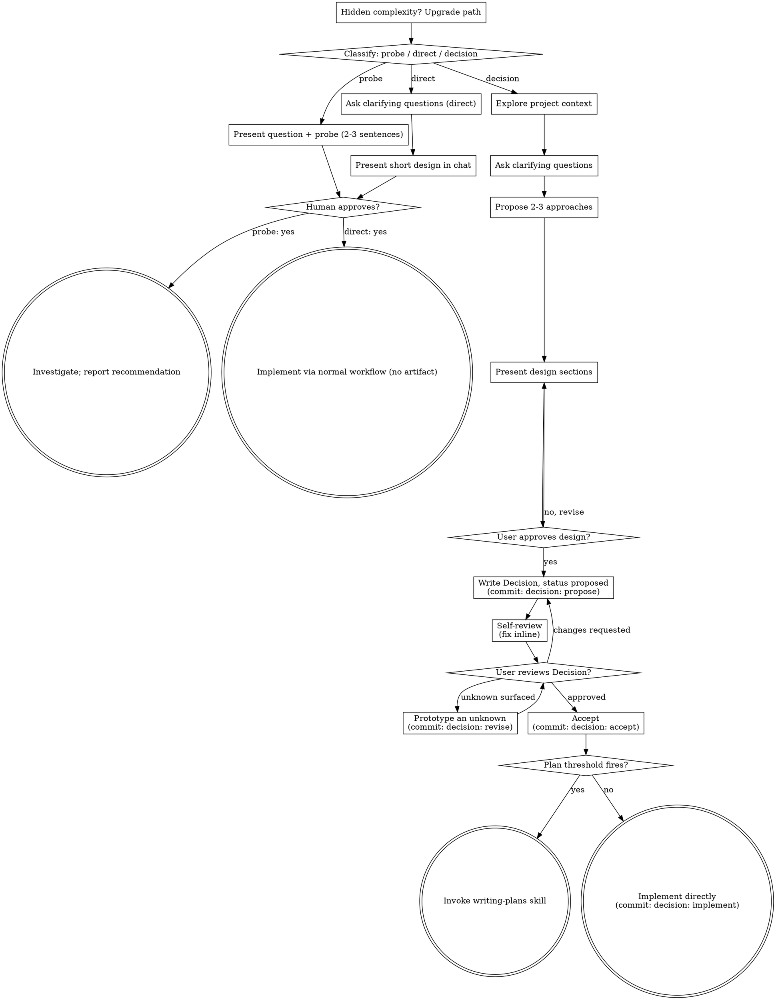

# Brainstorming Ideas Into Decisions

Help turn ideas into fully formed Conventional Docs Decisions through natural
collaborative dialogue.

Start by classifying how much process the request needs, then work through your
path: understand the context, refine the idea, present a design, and get your
human partner's approval.

## Provenance

Forked from [superpowers](https://github.com/obra/superpowers) `skills/brainstorming`
v6.3.0 — MIT, Copyright (c) 2025 Jesse Vincent. The classification-then-approval
structure, the hard approval gate, and the red-flag framing are his. Retargeted at
[Conventional Docs](https://github.com/phatblat/conventional-docs): the output is a
numbered Decision with a status lifecycle instead of a dated design spec, and the
handoff is a branch-lifetime `PLAN.md` instead of a permanent plan document.

### Divergence from upstream

1. Path vocabulary: `spike` / `bounded` / `architectural` → **Probe** / **Direct** /
   **Decision**, keyed to Conventional Docs' own two thresholds rather than to a
   subjective sense of size.
2. Output artifact: `docs/superpowers/specs/YYYY-MM-DD-<topic>-design.md` → a numbered
   Decision. Numbered, not dated; statused, not frozen-on-write.
3. Plan: `docs/superpowers/plans/YYYY-MM-DD-<x>.md` (permanent) → `PLAN.md`
   (branch-lifetime, deleted before merge).
4. Review + prototype are *phases of a proposed Decision*, not post-hoc chat. Prototype
   findings land in the Decision under `## Prototype Findings`.
5. New event commit `decision: revise NNNN <what changed>` — a local extension beyond
   the five verbs in the conventional-docs README. Flag it here as a candidate to
   upstream.
6. Status `implemented` extends MADR's set (`proposed`/`rejected`/`accepted`/
   `deprecated`/`superseded`); the template documents it.
7. The parallel multi-expert exploration from the prior local `brainstorm` skill is
   absorbed as an optional exploration move (see Exploring the Idea), so nothing is
   lost.
8. The browser visual companion is **not** ported — its judgment is salvaged as
   `### Showing versus telling` below; its scripts are not.

Out of scope: the skill never writes `.changes/<slug>.md` release-note fragments —
those describe shipped behavior and belong to implementation, not design.

<HARD-GATE>
Do NOT invoke any implementation skill, write any code, scaffold any
project, or take any implementation action until you have told your
human partner what you intend and they have approved it. This applies
to EVERY task on EVERY path below — the ceremony scales with the task;
the approval gate never does.
</HARD-GATE>

## Three Paths

Before your first question, classify the request and say the classification out
loud — "this looks Direct, so I'll present a short design here rather than write a
Decision" — so your human partner can override it:

| Path | Trigger | Output | Artifacts |
|---|---|---|---|
| **Probe** | A feasibility question — "can we", "is it possible", "quick and dirty is fine". Output is an answer, not code you keep. | A recommendation in chat. Anything built is labeled throwaway. | none |
| **Direct** | Below the Decision threshold: under ~100 lines, and does not change behavior, an interface, or a dependency. The flow being changed already exists in this repo to read. | A short design in chat (a few sentences to a few short paragraphs), then approval, then implement. | none |
| **Decision** | At or above the Decision threshold: ~100+ lines, **or** changes behavior, **or** changes an interface, **or** changes a dependency. New projects and new subsystems are always here — they have no existing flow to read. | A committed Decision, reviewed and accepted. | Decision; Plan if the Plan threshold also fires |

Conventional Docs states both thresholds verbatim: "a PR over ~100 lines, or one
that changes behavior, an interface, or a dependency, needs a Decision." "Work
spanning more than one session, or handed to another agent, needs a Plan." Below
both: "Anything smaller just happens." The two thresholds are **independent
gates**: an accepted Decision that fits one session and is not handed off is
implemented directly, with no Plan.

When in doubt between two paths, take the heavier one. The ratchet is one-way:
hidden complexity discovered mid-task upgrades the path — stop, say so, and step
up. Nothing downgrades mid-task.

## Anti-Pattern: "Too Simple To Need Approval"

Every path ends with your human partner approving your intent before
implementation. A todo list, a single-function utility, a config
change — the design may be two sentences in chat, but you MUST present
it and get approval. "Simple" tasks are where unexamined assumptions
cause the most wasted work. What scales with simplicity is the
artifact, never the approval.

## Red Flags

| Thought | Reality |
|---------|---------|
| "This is too simple to need a design" | Simple means a short design, not no design. Two sentences in chat, then approval. |
| "I'll call it Direct and skip the Decision" | Reaching for a label to skip work IS the doubt — take the heavier path. |
| "It's Direct and the design is obvious — I'll start while they read it" | The gate is the approval, not the design's length. Present, then stop until you hear yes. |
| "I understand this kind of app, so it's Direct" | Direct measures the repo, not your familiarity. A new project has no existing flow — it is a Decision. |
| "The probe works, so I'll keep the code" | A probe's output is an answer. Keeping the code is a new request — classify it. |
| "It grew, but I'm almost done — no need to re-classify" | Hidden complexity upgrades the path mid-task. Stop and say so. |
| "They approved the probe, so the follow-up change is approved too" | Each task gets its own classification and its own approval. |

## Artifact Location

Evaluate in order, first match wins; announce the resolved mode before writing
anything:

1. `docs/decisions/` exists → **graduated**. Write `docs/decisions/NNNN-slug.md`.
2. `DECISIONS.md` exists at repo root → **small**. Append a section to it.
3. `docs/` exists and contains any of `charter.md`, `design.md`, `roadmap.md`,
   `plan.md` → **graduated**. Create `docs/decisions/`.
4. Otherwise → **small**. Create `DECISIONS.md`.

Rules that go with it:
- Whenever the skill writes under `docs/decisions/` and root `.adr-dir` is absent,
  create it containing `docs/decisions` + newline. Idempotent; no other trigger.
- `NNNN` is zero-padded to 4 digits. Next number = `max + 1` across all three
  sources: `## NNNN` headings in `DECISIONS.md`, `NNNN-` filename prefixes in
  `docs/decisions/`, and `git log --all --grep='^decision: propose' --format=%s`
  (this catches numbers claimed on sibling branches and worktrees). Empty
  everywhere → `0001`.
- `slug` is kebab-case from the title: lowercase, `[a-z0-9-]` only, no leading or
  trailing hyphen, truncated at 50 characters.
- The skill **never graduates** `DECISIONS.md` on its own. When `DECISIONS.md`
  exceeds 400 lines or 8 decision sections, it says so in one sentence and
  continues in small mode. Graduation is the user's call and a separate
  mechanical move.
- No git repo → skip every commit gate, say so once, and continue. The artifact
  is still written.

## Phases and Commit Gates

The mandatory sequence, with exact commit subjects. Each gate commits **before**
the next phase begins.

| Phase | Artifact state | Commit subject |
|---|---|---|
| Draft | status `proposed` | `decision: propose NNNN <title>` |
| Review / prototype revision (repeats) | body edited, status stays `proposed` | `decision: revise NNNN <what changed>` |
| Acceptance | status `accepted` | `decision: accept NNNN` |
| Plan written | `PLAN.md` created (owned by `writing-plans`) | `plan: start NNNN` |
| Implemented | status `implemented` | `decision: implement NNNN (#PR)`, `(#PR)` omitted when there is no PR |

Committing rule, exact: `git commit -m "<subject>" -- <exact paths written>`. The
explicit pathspec form is required — it commits only those paths regardless of
what is already staged, so the skill can never sweep unrelated work into a
lifecycle commit. Never `git add -A`, never `git add .`, never `git commit -a`.

## Checklist

Classify first, announce the path, then create a task for each item on your path
and complete them in order.

**Probe:**
1. **Explore project context** — enough to frame the probe
2. **Present question + probe plan** — 2-3 sentences
3. **Get approval** — a nod is enough
4. **Investigate** — as cheaply as correctness allows
5. **Report findings** — a recommendation; label anything built as throwaway

**Direct:**
1. **Explore project context** — check files, docs, recent commits
2. **Ask clarifying questions** — one at a time, the ones that matter
3. **Present short design in chat** — approach, files touched, testing
4. **Get approval** — STOP and wait for an explicit yes; presenting the design and starting in the same breath is skipping the gate
5. **Implement** — proceed with the normal development workflow (TDD applies); no artifact

**Decision:**
1. **Explore project context** — check files, docs, recent commits
2. **Ask clarifying questions** — one at a time, understand purpose/constraints/success criteria
3. **Propose 2-3 approaches** — with trade-offs and your recommendation
4. **Present design** — in sections scaled to their complexity, get user approval after each section
5. **Write the Decision** — resolve artifact location, assign NNNN, write status `proposed`, commit `decision: propose NNNN <title>`
6. **Self-review** — check against `~/.agents/skills/brainstorm/references/decision-review.md`; fix inline
7. **User review** — ask the user to review the committed Decision; revise and re-commit until they approve
8. **Accept** — user says yes; set status `accepted`, commit `decision: accept NNNN`
9. **After acceptance** — invoke `writing-plans` if the Plan threshold fires; otherwise implement directly and close out per `## After Acceptance`

## Process Flow

**Terminal states are path-bound.** Decision: the only skill invoked after
acceptance (when the Plan threshold fires) is `writing-plans` — never an
implementation or design skill directly. Direct: after approval, implementation
proceeds directly through the normal development workflow; no artifact. Probe:
the terminal state is a reported recommendation.

## Exploring the Idea

The subsections below serve the Direct and Decision paths (a probe stops at
"present the probe, get a nod"). Sections from **Exploring approaches** onward
are Decision-path depth — for Direct work, context plus a few questions plus a
short in-chat design is the whole process.

**Understanding the idea:**

- Check out the current project state first (files, docs, recent commits)
- Before asking detailed questions, assess scope: if the request describes multiple independent subsystems (e.g., "build a platform with chat, file storage, billing, and analytics"), flag this immediately. Don't spend questions refining details of a project that needs to be decomposed first.
- If the project is too large for a single Decision, help the user decompose into sub-projects: what are the independent pieces, how do they relate, what order should they be built? Then brainstorm the first sub-project through the normal design flow. Each sub-project gets its own Decision → Plan cycle.
- For appropriately-scoped projects, ask questions one at a time to refine the idea
- Prefer multiple choice questions when possible, but open-ended is fine too
- Only one question per message - if a topic needs more exploration, break it into multiple questions
- Focus on understanding: purpose, constraints, success criteria

**Exploring approaches:**

- Propose 2-3 different approaches with trade-offs
- Present options conversationally with your recommendation and reasoning
- Lead with your recommended option and explain why
- YAGNI ruthlessly - remove unnecessary features from every approach and design

**Optional: parallel expert exploration.** When the topic spans domains that no
single perspective covers well, dispatch 2-4 subagents in parallel — one per
domain, at least one instructed to attack the obvious approach. Each returns
approaches with trade-offs, the confidence level behind each claim, and anything
it could not verify. Fold consensus, divergence, and unverified claims into the
Options section. Skip this for single-domain topics; it is a tool, not a phase.
Name a shared specialist from `~/.agents/harness/agents/*.toml`
(`ai-sdk-expert`, `cli-expert`, `code-review-expert`, `nestjs-expert`,
`research-expert`, `triage-expert`) when one fits the domain; otherwise dispatch
the host's general-purpose subagent with a domain-specific prompt.

### Showing versus telling

Decide per question, not per session. The test: would they understand this
better by seeing it than reading it? Content that *is* visual — layouts,
architecture diagrams, side-by-side comparisons, spacing and hierarchy — earns a
picture; requirements, conceptual A/B/C choices, trade-off lists, and
API/data-model decisions stay in the terminal. A question merely *about* a UI
topic is not a visual question. 2-4 options max; scale fidelity to the question.
Route this at tooling that already exists here: the `diagram` skill for
architecture and flow, `design-shotgun` / `design-html` for UI mockups,
`browser.open` to view the result.

**Presenting the design:**

- Once you believe you understand what you're building, present the design
- Scale each section to its complexity: a few sentences if straightforward, up to 200-300 words if nuanced
- Ask after each section whether it looks right so far
- Cover: architecture, components, data flow, error handling, testing
- Be ready to go back and clarify if something doesn't make sense

**Design for isolation and clarity:**

- Break the system into smaller units that each have one clear purpose, communicate through well-defined interfaces, and can be understood and tested independently
- For each unit, you should be able to answer: what does it do, how do you use it, and what does it depend on?
- Can someone understand what a unit does without reading its internals? Can you change the internals without breaking consumers? If not, the boundaries need work.
- Smaller, well-bounded units are also easier for you to work with - you reason better about code you can hold in context at once, and your edits are more reliable when files are focused. When a file grows large, that's often a signal that it's doing too much.

**Working in existing codebases:**

- Explore the current structure before proposing changes. Follow existing patterns.
- Where existing code has problems that affect the work (e.g., a file that's grown too large, unclear boundaries, tangled responsibilities), include targeted improvements as part of the design - the way a good developer improves code they're working in.
- Don't propose unrelated refactoring. Stay focused on what serves the current goal.

## Review

After the `decision: propose` commit:

- Self-review inline against the checklist in
  `~/.agents/skills/brainstorm/references/decision-review.md`. Fix findings in
  place; do not re-review.
- Then hand the file to the human: "Decision NNNN written and committed to
  `<path>`. Please review it and tell me what to change before we accept it."
  Wait. Requested changes → edit, commit `decision: revise NNNN <what changed>`,
  ask again.
- The skill **never** sets `accepted` itself. Only an explicit human yes does.

## Prototype

Enter only when review surfaces an unknown that reading the codebase cannot
settle.

- Announce what the prototype will answer, in one or two sentences, and get a
  nod first.
- Where it runs: needs the repo's own code → throwaway worktree on branch
  `proto/NNNN-<slug>`, created via the `git-worktree` skill; otherwise a scratch
  directory under the system temp dir. Either way the code is throwaway and is
  **never** committed to the Decision's branch.
- Record what was tried, what it proved or disproved, and what changed in the
  Decision as a result, under the Decision's `## Prototype Findings`. Commit
  `decision: revise NNNN <what the prototype changed>`.
- Delete the worktree or scratch directory when done.

## After Acceptance

- Plan threshold fires (spans more than one session, or hands off to another
  agent) → invoke the `writing-plans` skill, passing the Decision number and
  path. That is the only skill invoked from here.
- Plan threshold does not fire → implement in this session through the normal
  workflow, then set status `implemented` and commit
  `decision: implement NNNN`.
- Preserve upstream's terminal-state discipline: from the Decision path the only
  skill invoked is `writing-plans` — never an implementation or design skill.
