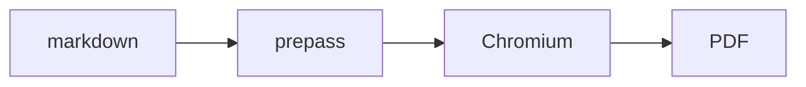

# How to put diagrams in your documents (and export beyond PDF)

This guide covers the diagram + multi-format engine that ships with
`/make-pdf` and `/diagram` (v1.58.0.0+). Everything here runs fully offline:
the mermaid and excalidraw runtimes are vendored in `lib/diagram-render/`,
loaded into the browse daemon's Chromium. No CDN, no network at render time.

## Render a mermaid diagram inside a PDF

Put a fence in your markdown. That's it.

````markdown

````

```bash
make-pdf generate doc.md out.pdf
```

The fence renders as a **vector** diagram (crisp at any zoom, selectable
text), with the `title` as caption and accessibility label. The raw mermaid
source is preserved base64-encoded in a `data-gstack-source` attribute on the
figure for debugging and round-trips (an HTML comment would corrupt mermaid's
`-->` arrows). One catch: the fence must start at **column 0** — indented
fences (inside lists, for example) stay plain code blocks by design.

**Fence options** (space-separated in the info string):

| Option | Effect |
|---|---|
| `title="..."` | caption below the diagram + `aria-label` |
| `render=false` | keep the fence as a plain code block |
| `page=landscape` | force this diagram onto its own landscape page |
| `page=portrait` | veto auto-landscape for this diagram |

A fence that fails to parse renders as a loud red diagnostic block with the
parse error and source excerpt — your document still builds, and the error
is impossible to miss.

` ```excalidraw ` fences work the same way; the body is a full `.excalidraw`
scene file (what excalidraw.com saves with File → Save).

## Control image size and orientation

Local images are inlined automatically (relative paths resolve against the
markdown file) and **never truncate** — every image caps at the content box.
Oversized photos downscale to print resolution (300dpi at the content width),
so a phone photo doesn't bloat the document.

Image safety defaults: remote (http/https) images are **blocked with a
visible placeholder** unless you pass `--allow-network`. An image path that
resolves outside the markdown's directory (even through a symlink) still
inlines but warns loudly. Files over 64MB and non-regular files (fifos,
devices) degrade to a placeholder instead of hanging the render.

Per-image directives go immediately after the image:

```markdown
{width=full}
{width=2in}
{page=landscape}
{page=portrait}
```

`width=` accepts `full`, a percentage (`50%`), or a dimension (`3in`, `8cm`,
`200px`). `page=` forces or vetoes a dedicated landscape page.

**Auto-landscape:** a wide, small-text, diagram-like image gets its own
vertically-centered landscape page automatically — inside an otherwise
portrait document. The heuristic is deliberately conservative (aspect ratio
≥ 1.8, intrinsic width over ~2.5x the content box, and a diagram-ish alt
word: diagram / architecture / flowchart / chart / graph). If it doesn't
fire when you want it, add `{page=landscape}`; if it fires when you don't,
add `{page=portrait}`.

## Export single-file HTML or Word

```bash
make-pdf generate doc.md out.html --to html
make-pdf generate doc.md out.docx --to docx
```

- **`--to html`** writes ONE self-contained file: diagrams as inline SVG,
  images as data URIs, zero network references (under the default offline
  posture — `--allow-network` deliberately keeps remote image tags live),
  plus a screen-reading layer (centered measure, padding). Email it, attach
  it, open it anywhere.
- **`--to docx`** is a content-fidelity export: headings, tables, code
  blocks, lists, and diagrams (embedded as 300dpi PNGs with alt text) carry
  over. Page-perfect layout does not — that's Word's job once it's open.

Heads-up: `--to` is the output format. `--format` is an old alias for
`--page-size` — different thing.

## Generate a diagram from English

```
/diagram make a flowchart of our deploy pipeline: build, test, canary, promote
```

The skill authors mermaid and emits a **triplet**:

| File | Use it for |
|---|---|
| `<slug>.mmd` | the source of truth — edit and re-render |
| `<slug>.excalidraw` | open at excalidraw.com (File → Open), move boxes, hand back |
| `<slug>.svg` / `<slug>.png` | docs, issues, READMEs, chat |

Flowcharts convert to fully editable excalidraw scenes. Other mermaid types
(sequence, state, gantt) render to SVG/PNG fine but skip the `.excalidraw`
artifact — an upstream converter limitation the skill will tell you about.

For documents, embed the `.mmd` source in your markdown instead of the PNG —
`/make-pdf` renders it as vector and the diagram stays editable forever.

## CI: fail loud instead of shipping placeholders

```bash
make-pdf generate docs.md --strict
```

Missing local images, blocked remote images, out-of-tree image reads (a path
or symlink resolving outside the markdown's directory), oversized files
(>64MB), and non-regular files all exit non-zero instead of degrading to a
warning or placeholder — for docs pipelines where a broken image should
break the build.

## Troubleshooting

- **"diagram-render bundle not found"** → run `bun run build:diagram-render`
  in the gstack repo, or re-run `./setup`.
- **Diagram renders but looks squished inline** → it's wide; give it room
  with `page=landscape` on the fence.
- **A two-row "racetrack" loop instead of one long line:** mermaid subgraph
  trick — top-level `flowchart TB`, two subgraphs with `direction LR` and
  `direction RL`, connect the *subgraphs* (node-level edges across subgraph
  boundaries silently disable `direction`).
- **"[remote image blocked]" placeholder** → remote images are never fetched
  by default (offline posture); the tag is replaced with a visible
  placeholder so Chromium can't fetch it at print time either. Pass
  `--allow-network` to opt in.
